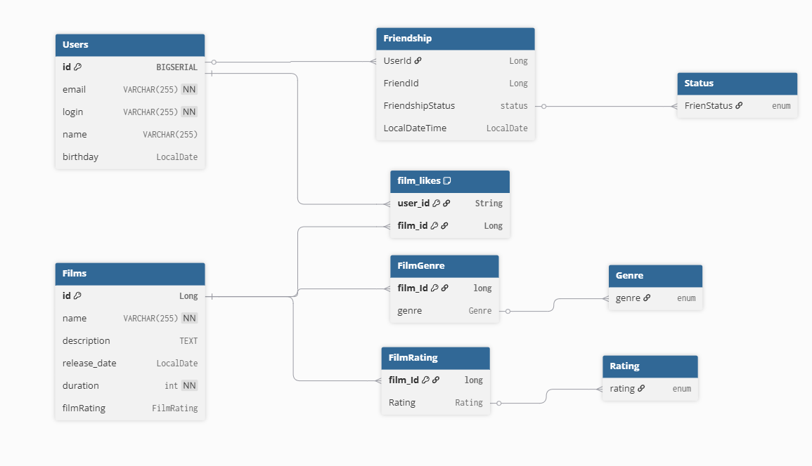

# java-filmorate

Диграмма показываеь связи между пользователями и фильмами, а так же как ставяься лайки к фильмам.

Template repository for Filmorate project.

Замечания к схеме:
1) Нет таблицы где хранятся жанры (есть FilmGenre - она будет связующей)
2) Таблица film_likes. user_id типа string, должно быть long
3) Таблица FilmRating. Не понятно, что за сущность estimation типа Rating. Подсказка - нужно сделать по аналогии с жанрами.
4) Таблица Friendship. Не понятно, что за тип "status" у поля FriendshipStatus , предлагаю использовать bool (0 / 1)
5) Таблица Friendship. Название поля LocalDateTime не отображает его назначение, предлагаю назвать что-то вроде Friendship_datetime (Дата-время дружбы) или как-то иначе на твое усмотрение. Обрати внимание, что тип Date у этого поля, нужно datetime или timestamp. Если хочешь чтобы там была только дата, тогда поле назови соответствующе - Friendship_date

Крайне желательно сделать:
6) Единообразие в названиях. Например название таблиц сущностей с большой буквы без нижнего подчеркивания (FilmGenre, FilmLikes), а названия полей - маленькими буквами snake_case (например film_id, genre_id, user1_id, user2_id, friendship_status). Четкого гайда нет, но используй единый стиль. Можешь и там и там использовать snake_case ( например film_genre для таблиц, genre_id для полей)
7) Не хватает описания и/или примеры SQL-запросов к таблицам
